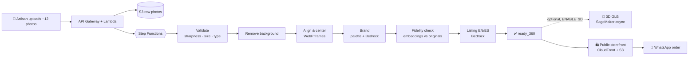

<div align="center">

# 🏺 Vitrina

### Let buyers *spin* your craft.

Upload ~12 photos of a handmade piece and get a public storefront where customers can rotate it in 360° with **real photos** — and order straight from WhatsApp. No login. No design skills.


**AWS Zero to Shipped** · `#commercial-potential` · `#startups`

</div>

---

## ✨ Why Vitrina

Small artisans sell through chat and social media with a handful of flat photos. Buyers can't judge a piece they can't turn in their hands, so they hesitate, ask for more pictures, or walk away.

Vitrina turns a quick photo session into an interactive storefront:

| | |
|---|---|
| 📸 **Guided capture** | Walk around the piece with your phone. Vitrina tells you what's missing. |
| 🧼 **Clean, real views** | Backgrounds removed, frames aligned and centered — **never invented or "enhanced" by generative AI.** |
| 🔄 **360° viewer** | Drag or swipe to spin the piece, with inertia and progressive loading. Optional 3D model as a bonus. |
| 🎨 **Instant brand** | A color palette and tone extracted from your piece; your next products inherit it. |
| ✍️ **Listings in two languages** | Names and descriptions in English and Spanish, without inventing materials, origin or sizes. |
| 💬 **Order on WhatsApp** | One tap opens a chat with the product message pre-filled. |
| 🔑 **No accounts** | Manage your store through a secret edit link. |

> **Fidelity first.** Every processed frame is compared with its original photo using multimodal embeddings. Views that drift from reality are discarded.

## 🧭 How it works



The 360° viewer is the foundation and must always work. 3D sits behind a feature flag: if it fails, only the extra disappears.

## 🏗️ Architecture (AWS, `us-east-1`)

| Layer | Service |
|---|---|
| Frontend hosting | **S3** + **CloudFront** (Origin Access Control) |
| API | **API Gateway** (HTTP API) + **Lambda** (Python 3.12, arm64) |
| Data | **DynamoDB** (on-demand) · **S3** (photos, frames, GLB) |
| Orchestration | **Step Functions** (Standard) |
| AI | **Amazon Bedrock** (text, multimodal, embeddings) · **SageMaker** async inference for optional 3D, scaling to zero |
| Secrets & config | **SSM Parameter Store** (SecureString) |
| Operations | **CloudWatch** · **CloudTrail** · **AWS Budgets** |
| Infrastructure as code | **AWS SAM** (`infra/template.yaml`) |

Design rules: least-privilege IAM per function (all roles carry a permissions boundary), no NAT Gateway, no always-on GPU, no secrets in the repo.

## 🌍 Internationalization

The UI ships in **English and Spanish**.

- On first visit the language follows the browser: `es*` → Spanish, anything else → English.
- A visible toggle lets users switch; the choice is remembered.
- Generated product copy is produced in both languages.

## 🗂️ Repository layout

```
vitrina/
├── infra/          # AWS SAM template + IAM policies & budget definitions
│   └── iam/
├── backend/        # Lambda functions (Python 3.12)
├── frontend/       # SPA (Vite + React + TypeScript)
├── docs/           # BUILD_LOG, DECISIONS, ARCHITECTURE, mockups, evidence
├── SPEC.md         # Product & technical specification
├── PLAN.md         # Schedule and cut rules
├── SETUP.md        # Environment and AWS setup guide
└── CLAUDE.md       # Standing instructions for the coding agent
```

## 🚀 Getting started

**Prerequisites:** AWS CLI v2, AWS SAM CLI, Node 20+, Python 3.12, Git, and an AWS account with a limited IAM user (see [`SETUP.md`](SETUP.md)).

```bash
git clone https://github.com/hallzyx/vitrina.git
cd vitrina
cp .env.example .env            # fill in the placeholders; never commit .env

aws login                       # or: aws configure sso
aws sts get-caller-identity     # confirm you are NOT root

cd infra
sam validate --lint
sam build
sam deploy --guided             # region: us-east-1
```

The stack outputs the public site URL, the API URL, the frontend bucket and the CloudFront distribution ID.

## 🚦 Status

Built for the AWS **Zero to Shipped** hackathon (Sep 18 – Oct 2, 2026).

- [x] Specification, plan and setup docs
- [x] Limited IAM user, permissions boundary and USD 20/month budget alarm
- [x] SAM skeleton: S3 + CloudFront + `GET /health`
- [ ] Skeleton deployed with a public URL
- [ ] 360° pipeline end to end (Step Functions + Bedrock)
- [ ] Storefront, viewer, dashboard, example store (`/s/example`)
- [ ] Optional 3D branch (`ENABLE_3D`)

See [`PLAN.md`](PLAN.md) for the day-by-day schedule and [`SPEC.md`](SPEC.md) for the full specification.

## 🔒 Security & cost guardrails

- The example store is public and needs no code; live generation is protected by an access code stored in SSM.
- Edit tokens are ≥ 128 random bits; only their SHA-256 hash is stored.
- Per-visitor daily product limit, API throttling, file size/type validation.
- S3 with public access blocked; CORS restricted to the site origin.
- AWS Budgets alerts at 50 / 80 / 100 % of a USD 20 monthly cap.

## 🤖 Built with an AI coding agent

Development is done with **Claude Code** connected to the **AWS MCP Server**, using a least-privilege IAM identity. Every AWS-changing step is documented in [`docs/BUILD_LOG.md`](docs/BUILD_LOG.md), and decisions in [`docs/DECISIONS.md`](docs/DECISIONS.md).

Commits follow [Conventional Commits](https://www.conventionalcommits.org/).

---

<div align="center">

Made with ☕ for artisans everywhere · **Vitrina**

</div>
