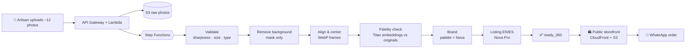

<div align="center">

# 🏺 Vitrina

### Let buyers *spin* your craft.

Upload ~12 photos of a handmade piece and get a public storefront where customers can rotate it in 360° with **real photos** — and order straight from WhatsApp. No login. No design skills.


**AWS Zero to Shipped** · `#commercial-potential` · `#startups`

</div>

---

## ✨ Why Vitrina

Small artisans sell through chat and social media with a handful of flat photos. Buyers can't judge a piece they can't turn in their hands, so they hesitate, ask for more pictures, or walk away.

Vitrina turns a quick photo session into an interactive storefront:

| | |
|---|---|
| 📸 **Guided capture** | Walk around the piece with your phone. Vitrina tells you what's missing. |
| 🧼 **Clean, real views** | Backgrounds removed, frames aligned and centered — **never invented or "enhanced" by generative AI.** |
| 🔄 **360° viewer** | Drag or swipe to spin the piece, with inertia and progressive loading. |
| 🎨 **Instant brand** | A color palette and tone extracted from your piece; your next products inherit it. |
| ✍️ **Listings in two languages** | Names and descriptions in English and Spanish, without inventing materials, origin or sizes. |
| 💬 **Order on WhatsApp** | One tap opens a chat with the product message pre-filled. |
| 🔑 **No accounts** | Manage your store through a secret edit link. |

> **Fidelity first.** Every processed frame is compared with its original photo using multimodal embeddings. Views that drift from reality are discarded.

## 🧭 How it works



While a product is processing, the creator watches a real-time "workbench": the photos lose their background one by one, align into a ring and start to spin, with the real fidelity score of each frame.
The real-photo 360° viewer is the whole product: it has no optional dependency. (An optional 3D branch was evaluated and dropped, see [`docs/DECISIONS.md`](docs/DECISIONS.md).)

## 🏗️ Architecture (AWS, `us-east-1`)

| Layer | Service |
|---|---|
| Frontend hosting | **S3** + **CloudFront** (Origin Access Control) |
| API | **API Gateway** (HTTP API) + **Lambda** (Python 3.12, arm64) |
| Data | **DynamoDB** (on-demand) · **S3** (photos, frames, GLB) |
| Orchestration | **Step Functions** (Standard) |
| AI | **Amazon Bedrock**: Titan Multimodal Embeddings (fidelity) and Nova Pro (brand and EN/ES listing). Background removal is an ONNX mask computed inside Lambda |
| Secrets & config | **SSM Parameter Store** (SecureString) |
| Operations | **CloudWatch** · **CloudTrail** · **AWS Budgets** |
| Infrastructure as code | **AWS SAM** (`infra/template.yaml`) |

Design rules: least-privilege IAM per function (all roles carry a permissions boundary), no NAT Gateway, no GPU, no secrets in the repo. A diagram and the request paths are in [`docs/ARCHITECTURE.md`](docs/ARCHITECTURE.md); the submission summary for judges is [`docs/SUBMISSION.md`](docs/SUBMISSION.md).

## 🌍 Internationalization

The UI ships in **English and Spanish**.

- On first visit the language follows the browser: `es*` → Spanish, anything else → English.
- A visible toggle lets users switch; the choice is remembered.
- Generated product copy is produced in both languages.

## 🎨 Frontend

`frontend/` is a Vite + React 18 + TypeScript (strict) SPA with `react-router-dom`.

| Concern | Choice |
|---|---|
| Styling | **Tailwind CSS v4** (`@tailwindcss/vite`). All design tokens (colors, fonts, radii, shadows, motion) live in the `@theme` block of `src/styles.css`; shared recipes (buttons, cards) in `src/components/ui.ts`. |
| Type | Fraunces (display) + Instrument Sans (text), self-hosted via Fontsource. No third-party font requests. |
| Landing hero | **three.js**: a lathe-turned piece on a turntable, drawn in real time with the same surface patterns as the demo pieces. Loaded lazily in its own chunk. |
| Motion | **motion** (`motion/react`) for scroll-linked storytelling and reveals, landing only. Respects `prefers-reduced-motion`. |
| Icons | **react-icons** (Lucide set, `react-icons/lu`), imported per icon. |

The 3D hero is an illustration, not a product view: stores always show the artisan's real photos in the frame-based 360° viewer (`src/components/Viewer360.tsx`). The hero never renders blank: weak devices, `saveData`, missing WebGL or any runtime error fall back to that same 360° viewer (append `?lite` to the URL to force the fallback, `?3d` to force WebGL).

All data comes from the API (`src/lib/api.ts`, typed): public stores and the example store, the creator endpoints (edit token in `X-Edit-Token`, invite phrase in `X-Access-Code`) and direct photo uploads to S3 with presigned POST forms. `/create` offers two paths: **sample photos** (no invite phrase; a live run, or a clearly labeled replay of a recorded run when today's live runs are used up) and **your own photos** (invite phrase). Demo stores and products are labeled as demos; the "real photos" badge is reserved for products made from a user's own photos.

```bash
cd frontend
npm ci
npm run dev       # local development (proxies /api, /media and /samples to the deployed site)
npm run build     # type-check + production build (dist/)
npx vite preview --port 4173   # serve the production build, same proxy
```

### Backend

`backend/src` holds the Lambdas (Python 3.12, `boto3` from the runtime, no extra dependencies): `handlers/` (one module per function) and `common/` (validation, limits, security, SSM access). Create and edit endpoints sit behind an **invite phrase** kept in SSM Parameter Store; public endpoints and the example store never need it. See [`SPEC.md`](SPEC.md) §6 for the API and [`docs/DECISIONS.md`](docs/DECISIONS.md) for the reasoning.

```bash
cd backend
python -m venv .venv && . .venv/bin/activate      # Windows: .venv\Scripts\activate
pip install -r requirements-dev.txt
pytest                                            # moto-backed tests, no AWS account needed
```

## 🗂️ Repository layout

```
vitrina/
├── infra/          # AWS SAM template + IAM policies & budget definitions
│   └── iam/
├── backend/        # Lambda functions (Python 3.12)
├── frontend/       # SPA (Vite + React + TypeScript)
├── scripts/        # deploy, publish, pause, destroy, example seeding
├── docs/           # SUBMISSION, ARCHITECTURE, BUILD_LOG, DECISIONS, CREDITS
├── SPEC.md         # Product & technical specification
├── PLAN.md         # Schedule and cut rules
├── SETUP.md        # Environment and AWS setup guide
└── CLAUDE.md       # Standing instructions for the coding agent
```

## 🚀 Getting started

**Prerequisites:** AWS CLI v2, AWS SAM CLI, Node 20+, Python 3.12, Git, and an AWS account with a limited IAM user (see [`SETUP.md`](SETUP.md)).

```bash
git clone https://github.com/hallzyx/vitrina.git
cd vitrina
cp .env.example .env            # fill in the placeholders; never commit .env

aws login                       # or: aws configure sso
aws sts get-caller-identity     # confirm you are NOT root

cd infra
sam validate --lint
sam build
sam deploy --guided             # region: us-east-1
```

The stack outputs the public site URL, the API URL, the frontend bucket and the CloudFront distribution ID. The scripts below wrap the same steps (`SAM=/path/to/sam` if `sam` is not on your PATH).

## ⏯️ Pause, resume and destroy

Everything is infrastructure as code, so it can be switched off and removed cleanly.

| Action | Command | Effect |
|---|---|---|
| **Deploy / update** | `scripts/deploy.sh` | Builds and deploys the `vitrina` stack in `us-east-1`. |
| **Publish the site** | `scripts/deploy-frontend.sh` | Builds the SPA, syncs it to S3 and invalidates CloudFront. |
| **Pause** | `scripts/pause.sh` | Sets `Paused=true`: CloudFront is disabled and the API throttles to zero. Data is kept. |
| **Resume** | `scripts/pause.sh resume` | Sets `Paused=false` and brings the site back. |
| **Destroy** | `scripts/destroy.sh` | Empties the buckets and deletes the stack. **Irreversible.** |

CloudFront takes a few minutes to apply enabling/disabling. There is no GPU and no resource with a fixed hourly cost, so an idle stack costs almost nothing.

## 🚦 Status

Built for the AWS **Zero to Shipped** hackathon (Sep 18 – Oct 2, 2026).

- [x] Specification, plan and setup docs
- [x] Limited IAM user, permissions boundary and USD 20/month budget alarm
- [x] Full stack as code (SAM): S3 + CloudFront + API Gateway + Lambda + DynamoDB + Step Functions + SSM
- [x] 360° pipeline end to end (in-function segmentation, Titan fidelity, Nova brand and listing): 12 photos to a spinnable product in about 40 s on the public URL
- [x] Create flow with sample photos (no code, live or recorded replay) or your own photos (invite phrase)
- [x] Real-time processing "workbench" with live previews and per-frame fidelity
- [x] Public store, buyer view with WhatsApp order, creator dashboard (edit listing and price, brand, publish), all in EN/ES
- [x] Guardrails: invite phrase with lockout, daily caps, owner allowlist for testing, budget alarm, pause and destroy scripts
- [x] 98 automated tests
- [x] Optional 3D branch: evaluated and dropped (see `docs/DECISIONS.md`)

See [`PLAN.md`](PLAN.md) for the day-by-day schedule and [`SPEC.md`](SPEC.md) for the full specification.

## 🔒 Security & cost guardrails

- The example store is public and needs no code; live generation is protected by an access code stored in SSM.
- Edit tokens are ≥ 128 random bits; only their SHA-256 hash is stored.
- Per-visitor and global daily caps, a lockout after repeated wrong phrases, API throttling, file size and type validation.
- S3 with public access blocked; CORS restricted to the site origin.
- AWS Budgets alerts at 50 / 80 / 100 % of a USD 20 monthly cap.

## 🤖 Built with an AI coding agent

Development is done with **Claude Code** connected to the **AWS MCP Server**, using a least-privilege IAM identity. Every AWS-changing step is documented in [`docs/BUILD_LOG.md`](docs/BUILD_LOG.md), and decisions in [`docs/DECISIONS.md`](docs/DECISIONS.md).

Commits follow [Conventional Commits](https://www.conventionalcommits.org/).

---

<div align="center">

Made with ☕ for artisans everywhere · **Vitrina**

</div>
