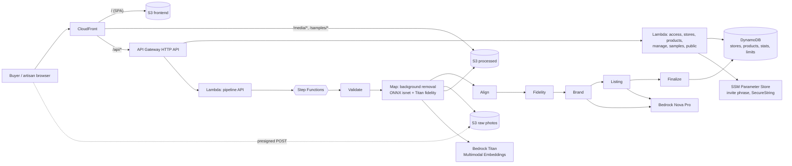

# Architecture

Everything runs in **us-east-1** and is defined in `infra/template.yaml` (AWS SAM). There are no NAT gateways, no GPUs and no resource with a fixed hourly cost: the stack is pay-per-use and idles at roughly zero.

## Request paths

- **Viewing a store** needs no code: CloudFront serves the SPA from S3, frame images from the processed bucket and the store JSON through `/api/public/*`.
- **Creating a store** requires the invite phrase (`X-Access-Code`, checked in constant time against SSM, lockout after repeated failures). The response contains the edit token once; only its SHA-256 is stored.
- **Uploads** go straight from the browser to S3 with presigned POST forms (size and content type enforced by the policy), so photos never pass through a Lambda.
- **Processing** is a Step Functions Standard workflow. Per-photo work runs with concurrency 3 and retries on throttling.
- **Sample gallery** runs the same pipeline on bundled sample photo sets (no phrase, protected by daily per-visitor and global caps), or replays a recorded run with its real step timings.

## Real-time processing view

While a product is processing, the token-protected status endpoint adds a `live` block: small previews of each finished photo and its cutout (same size, stored under `media/<store>/<product>/live/`), per-photo fidelity scores, the aligned thumbnails, the fidelity review and the brand palette once available. The frontend `workbench` renders them. The previews and progress attributes are removed when the run finishes or fails.

## Fidelity to the real product

The pipeline never generates pixels. Background removal produces a mask and leaves the piece's pixels untouched. Titan embeddings compare each photo with its cutout (on every second frame, because the on-demand quota is 20 requests per minute) and drop frames that drifted; the product records how many frames were actually checked.

## Guardrails and cost control

| Concern | Mechanism |
| --- | --- |
| Spend | AWS Budgets at USD 20/month (alerts 50/80/100%), daily global caps, per-visitor caps |
| Abuse | invite phrase with lockout, per-IP counters in a TTL table, uniform 403 on any auth failure |
| Secrets | none in the repo; phrase in SSM SecureString; Lambda roles under the `vitrina-boundary` permissions boundary |
| Pause / remove | `scripts/pause.sh` (closes the write paths, keeps the example online), `scripts/destroy.sh` |

## Data

| Table | Key | Purpose |
| --- | --- | --- |
| stores | `storeId` (GSI `slug-index`) | store record, brand, token hash |
| products | `storeId` / `productId` | status, frames, copy (EN/ES), fidelity |
| stats | `storeId` / `sk` | views and WhatsApp clicks |
| limits | `pk` (TTL) | rate and quota counters |
